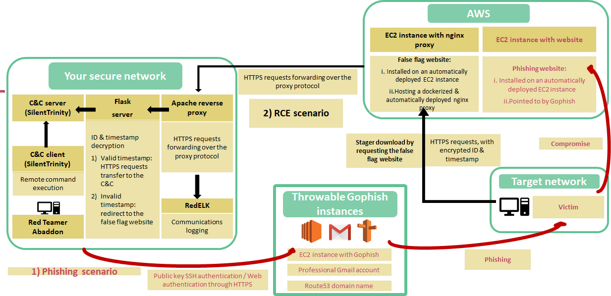

# Abaddon


Red team operations involve miscellaneous skills, last several months and are politically sensitive; they require a lot of monitoring, consolidating and caution. Wavestone’s red team operations management software, Abaddon, has been designed to make red team operations faster, more repeatable, stealthier, while including value-added tools and bringing numerous reporting capabilities.

**Because**:

- There are tons of tools used by red teamers
- ... but no operation management (and free and open-source) software
- ... and no aggregation between these tools, anyway
- ... and "Operational security" failures are common

**What did we want with Abaddon ?**:

Abaddon aims at facilitating red team operations by:

- **Reducing the time to build an infrastructure**
- **Enabling complex actions with 1 or 2 clicks**
- **Enabling easier reporting for long operations**
- **Reducing the “OPSEC failure” risk**

The slides presenting Abaddon at RSAC2020 can be found here: ([Abaddon, the red team angel](https://www.rsaconference.com/usa/agenda/abaddon-the-red-team-angel))

# What you can deploy



- Deployed within 30 minutes 
- Throwable, authenticated, stealth
- Enables phishing as well as remote command execution

## Other features

- Reconnaissance: graphical interface to NMAP, Recon-NG, HunterIO, and Amass
- Weaponization: generation of obfuscated payloads under development
- Delivery: one or two-clicks deployment of EC2 instances, Gophish, and of a fully functionnal, stealthy & dockerized C&C infrastructure as shown above
- Exploitation & Post-Exploitation: ideas under development :)
- Reporting: a simple dashboard ready but still under development to follow your operations

# Installing and launching Abaddon

Abaddon has been tested on Debian, LUbuntu, and of course KALI Linux (latest tests have been performed on the 5.4.0 amd64 version).
You also need to have Internet access, and  a public IP address if you want to deploy your C&C server locally.

Note that to configure your AWS environment, the easiest way is probably to install the aws-cli like indicated here: https://docs.aws.amazon.com/fr_fr/cli/latest/userguide/install-cliv2-linux.html

```sh
curl "https://awscli.amazonaws.com/awscli-exe-linux-x86_64.zip" -o "awscliv2.zip"
unzip awscliv2.zip
sudo ./aws/install
```

1. Clone this repository and move inside the repository folder

```sh
git clone git@github.com/wavestone-cdt/abaddon.git
cd abaddon
```

2. Create the files ~/.aws/credentials and ~/.aws/config with your AWS credentials and configuration, using the following command:

```sh
aws configure
```

3. Move settings.py.sample to settings.py. Add change the database user password (This password will be asked durring the setup process)

```sh
mv abaddon/settings.py.sample abaddon/settings.py
sed -i 's/yourPasswordHere/<databasepassword>/g' abaddon/settings.py
```

4. Launch the following command in the abaddon/setup folder:

```sh
bash setup/install.sh
```

This script will:

- Update your OS
- Install the packages that are required by Django and Abaddon (including docker and docker-compose)
- Install all the python dependencies (including Django 3.X)
- Create a PostgreSQL database and a user with the right role (the password for the database that you need to give is inside the abaddon/settings.py file, it is recommended to change the password)
- Apply Django migrations
- Create a superuser for the Django application, that will be used to connect to the graphical interface of Abaddon.

**Start the Red Team Angel !**

```sh
bash abaddon.sh
```

**Open a browser, and go to the URL 127.0.0.1:8000 (connect with the Django superuser credentials created during the installation).**

# Deployment of a C&C infrastructure inside Abaddon

7. If no EC2 instance has been deployed before from Abaddon (it is important that you deploy the EC2 from Abaddon, so that you have access to the SSH key, located in the aws folder), go to the **Delivery/Let’s phish!** page. Click on **Deploy EC2!**. Wait for the end of the deployment (you can check inside the terminal used to start Abaddon if the EC2 is ready to be used, all the deployment steps appear in the shell).

8. Go to the **misc/apache/default-ssl.conf** file and **UPDATE** the domain name of the EC2 inside the second VirtualHost. To avoid the detection of your infrastructure, buy a new domain name and configure it to point to your EC2. Use this domain name in the Apache configuration file and UPDATE **misc/apache/topsecret.key** and **misc/apache/topsecret.crt** accordingly, which is with the private key and the certificate of your new domain.

9. Go then to the **Monitor current Scenarios** page and click on **Configure a RedELK infrastructure**. Give this scenario a name. Abaddon supports actually only one scenario at the time. Choose an EC2 instance deployed from your Abaddon and choose **Local Deployment** (because you deploy your Apache docker locally). Then, choose the ports used by the  deployed EC2 to receive the HTTP and SSL connections, and the port and the IP address the Apache reverse proxy will forward the traffic to (for instance, the IP and port your SILENTTRINITY server listens to).
A common configuration would be the following:

`http port = 80`
`ssl port = 443`
`Listening Port= 9999`
`C2 IP adress = 172.16.0.1`

Wait for the end of the deployment and go back to the **Monitor current Scenarios page**.

# Getting Involved

Please do not hesitate to send us Pull Requests, or send me questions (@Ibrahimous).

## Call for Contributions

We really would like to see pentesters and other offensive security lovers get out of their secret zone, and share ideas, contribute to establishing a comprehensive framework for red team operations.

So, I you want to enhance the tool, please do. If you want to reshape it radically, please submit your ideas. 

## Documentation, Setup & Basic Usage

The documentation is a work in progress, and will very soon be available in the [Wiki](https://github.com/wavestone-cdt/abaddon/wiki).

## Author

Charles IBRAHIM ([@Ibrahimous](https://twitter.com/Ibrahimous))

## Acknowledgments, Contributors & Involuntary Contributors

**(In no particular order)**

- Marcello Salvati ([@byt3bl33d3r](https://twitter.com/byt3bl33d3r)), for SILENTTRINITY. Boo-lang, omg.
- Arthur Villeneuve ([@crypt0-M3lon](https://twitter.com/crypt0_m3lon)), for his gorgeous ideas about docker, the proxy protocol, and more.
- Romain Melchiorre, for integrating lots of great ideas
- Timon Glasser, for patching SILENTTRINITY, fixing bugs, integrating ideas, and making everything work smoothly during actual engagements!
- @sbnsec, for currently terraforming all the things!
- Arnaud Soullié ([@arnaudsoullie](https://twitter.com/arnaudsoullie)), because he overviewed most of the project!
